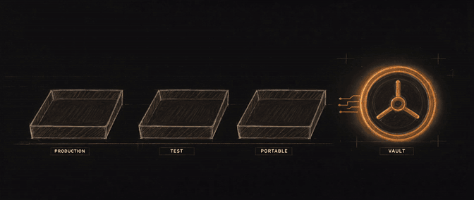
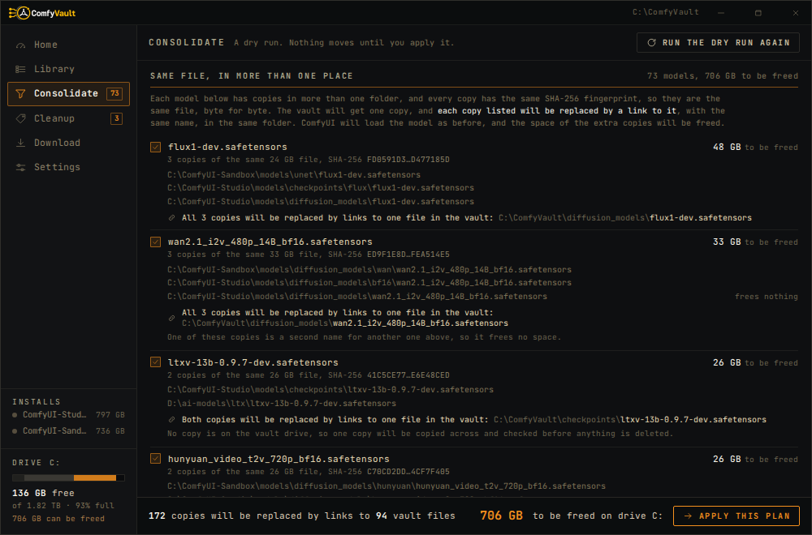
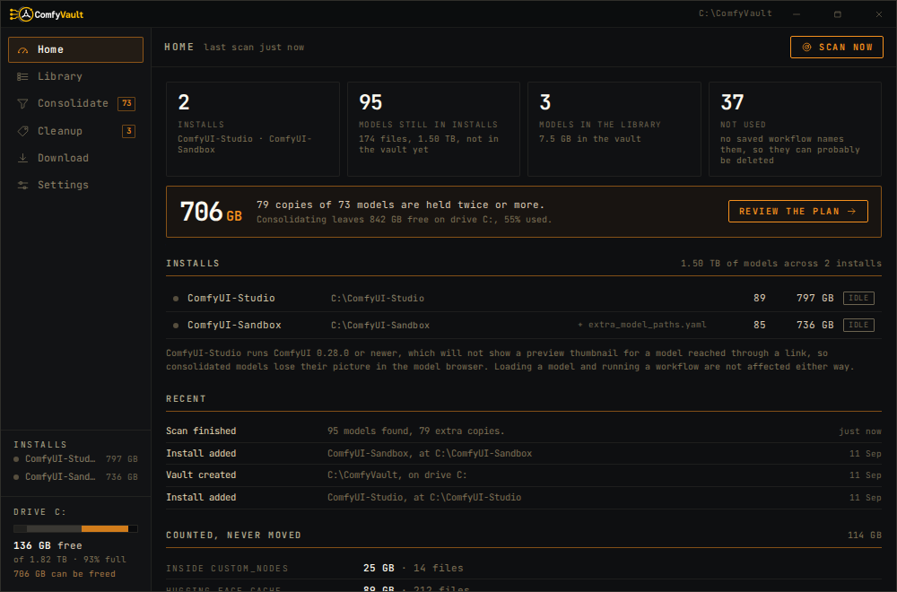
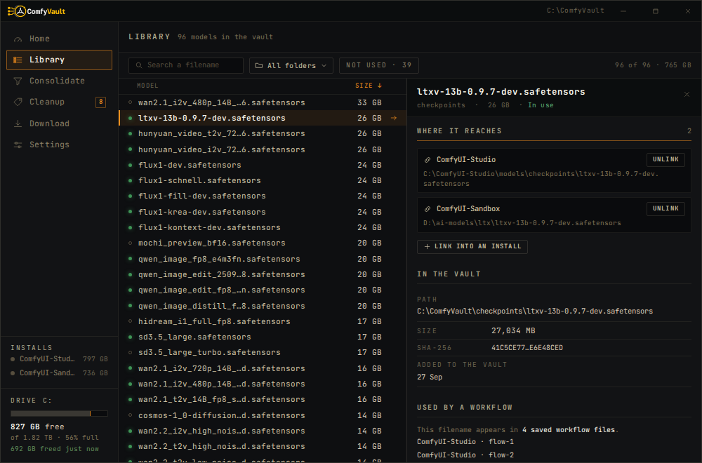
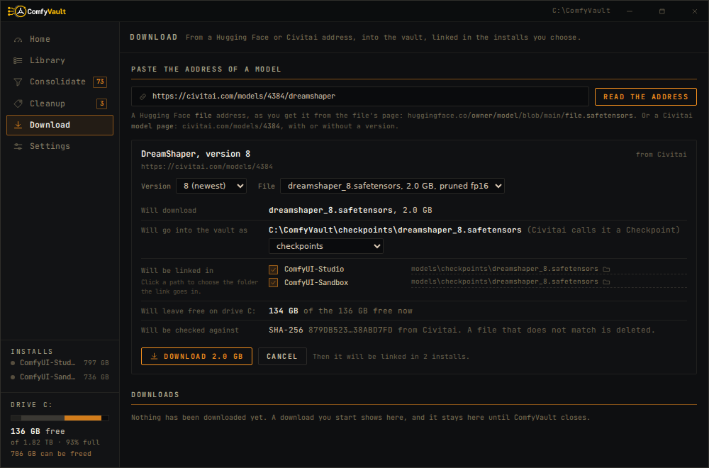
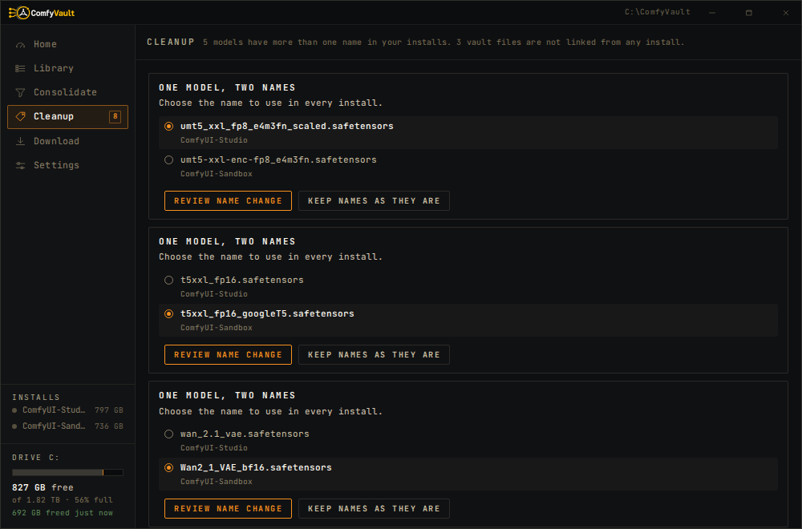

# ComfyVault

### Stop wasting disk space on duplicate ComfyUI models.

If you have more than one ComfyUI install, chances are you're storing the **same checkpoints, LoRAs, VAEs, and text encoders more than once**.

ComfyVault finds those duplicates, keeps **one copy**, and lets all your ComfyUI installs keep using it normally.

**Same models. Same workflows. A lot less wasted space.**

<p align="center">
  <a href="docs/media/comfyvault-hero.mp4">
    
  </a>
</p>

[](https://github.com/ruashots/ComfyVault/actions/workflows/ci.yml)
[](https://github.com/ruashots/ComfyVault/releases)
[](https://github.com/ruashots/ComfyVault)
[](LICENSE)

---

## Here's the idea

Say you have the same 12 GB model in three ComfyUI installs:

```text
ComfyUI-Production   12 GB
ComfyUI-Test         12 GB
ComfyUI-Portable     12 GB

                     36 GB total
```

ComfyVault keeps one copy:

```text
ComfyVault           12 GB
   ↑
   ├─ Production
   ├─ Test
   └─ Portable

                     12 GB total
```

### You get 24 GB back.

Your installs still see the model where they expect it, so your existing workflows keep working.

---

<p align="center">
  
</p>

## Download

### [⬇ ComfyVault for Windows](https://github.com/ruashots/ComfyVault/releases)

Grab the latest `ComfyVault-v<version>-windows-x64.exe` and run it.

No installer. No account. No telemetry.

> **Windows currently shows a SmartScreen warning because the app is not code-signed yet.**
>
> If you downloaded it from this repository's Releases page, use **More info → Run anyway**.

---

## Who is this for?

ComfyVault is useful if your machine looks something like this:

```text
ComfyUI-Production
ComfyUI-Old
ComfyUI-Video
ComfyUI-Portable
That-old-install-I-still-need
```

and each install has its own giant `models` folder.

If you only have one ComfyUI install and one clean model folder, you probably don't need it.

If you have several installs and vaguely remember downloading the same 10–20 GB model more than once, you probably do.

---

## How it works

### 1. Pick a vault

Choose an empty folder where the real model files will live.

For example:

```text
D:\ComfyVault
```

### 2. Add your ComfyUI installs

Production, test, portable, launcher-managed — add the ones you want compared.

### 3. Scan

ComfyVault checks the model files and finds which ones are actually identical.

### 4. Review

Before anything moves, you get a dry-run plan showing:

- which models are duplicated
- which copy will be kept
- which paths will become links
- how much space you can recover

### 5. Apply

One real copy stays in the vault, and the duplicates are replaced with links.

Your ComfyUI installs keep using the same filenames and paths as before.


<p align="center">
  
</p>

---

## It doesn't just compare filenames

These files:

```text
model.safetensors
model_v2.safetensors
final_REAL_THIS_ONE.safetensors
```

can still be recognized as the **same model** if their contents are identical.

That matters because real ComfyUI collections are messy:

- files get renamed
- folders get reorganized
- launchers make copies
- the same model gets downloaded more than once

ComfyVault looks at the actual file contents, not just the name.

---

## Your workflows keep working

ComfyVault does **not** force every install to use one shared folder.

Instead, it leaves a link where each original model file used to be.

So this:

```text
C:\ComfyUI-A\models\loras\portrait.safetensors
```

can still work normally even though the real file is now here:

```text
D:\ComfyVault\loras\portrait.safetensors
```

Saved workflows keep pointing at the same paths.

---

## It also becomes a model library

Once models are in the vault, ComfyVault can keep useful information about them:

- filename
- alternate filenames
- size
- model type
- linked installs
- link locations
- date added
- Civitai metadata
- base model
- trigger words
- saved workflow matches

So it becomes one place to see what models you actually have.


<p align="center">
  
</p>

---

## Download models once

Paste a Hugging Face or Civitai model URL.

Before anything starts, you can see:

- the file
- its size
- where it will go
- which installs will receive it
- the destination folder in each install

The model is downloaded once into the vault and linked into the installs you choose.

Downloads can be stopped and resumed, including after restarting the app.


<p align="center">
  
</p>

---

## It understands real ComfyUI setups

ComfyVault handles more than a clean default install:

- normal installs
- portable installs
- nested launcher layouts
- `extra_model_paths.yaml`
- external model folders
- ComfyUI's model categories
- supported model folders under `output`

It deliberately leaves these alone:

- files inside `custom_nodes`
- the Hugging Face cache

Those can have their own rules and assumptions.

---

# Is it safe?

That is the question that matters most for an app that moves model files.

ComfyVault is built to be cautious.

### Nothing moves during a scan

Scanning and planning are read-only.

You see what will happen before you press **Apply**.

### Files are checked again before changes

If a file changed after the scan, it is left alone instead of trusting stale information.

### Duplicates are checked before deletion

By default, the duplicate is read again before its bytes are removed.

The delete happens only after verifying it matches the copy being kept.

### Files are never overwritten

If something unexpected is already where ComfyVault needs to write, the operation stops.

### Interrupted runs can be recovered

Each step is recorded before it happens.

If the app closes or Windows crashes during a run, ComfyVault detects it on the next start.

You can finish the run or undo it.

### Undo is built in

A completed consolidation run can be undone.

Before starting, ComfyVault checks how much free space is needed to put the copies back.

If there is not enough room, it refuses to start.

### Cross-drive moves are verified

When a file has to move to another drive, the process is:

```text
copy
  ↓
flush
  ↓
read it back
  ↓
verify it
  ↓
delete the original
```

---

## Cleanup handles the messy cases

### Same model, different names

For example:

```text
style.safetensors
style_v2.safetensors
```

If both are the same file, your installs can keep using both names.

Or pick one name, and every install switches to it. ComfyVault lists any saved workflow that still uses the other name.

### Broken links

If a vault file disappears outside ComfyVault, links pointing to it are shown as broken.

### Orphaned models

If a model is in the vault but no install points to it anymore, ComfyVault can show it as an orphan.


<p align="center">
  
</p>

---

## Civitai metadata

ComfyVault can look up a model by its file fingerprint and show:

- model name
- version
- type
- base model
- trigger words
- Civitai page

It does not need your local filename or path for that lookup.

Civitai lookup can be turned off completely.

The core scan, vault, consolidate, cleanup, and undo features still work without it.

---

## “Unused” does not mean “safe to delete”

ComfyVault can search saved workflow files for model names.

That is useful, but it is not perfect.

A workflow you never saved may still exist only in your browser, so ComfyVault does **not** claim that a model is definitely safe to delete just because it was not found in saved workflows.

---

## Current limitation: ComfyUI thumbnails

Recent ComfyUI versions do not serve model preview images through per-file symbolic links.

A managed model can still:

- show up in ComfyUI
- load normally
- run normally
- work in existing workflows

while its preview image may not show in ComfyUI's model browser.

ComfyVault detects affected ComfyUI versions and tells you.

---

## Windows requirements

ComfyVault currently supports **Windows only**.

You need:

- Windows 10 or 11
- Microsoft Edge WebView2
- **Developer Mode enabled**

Developer Mode allows ComfyVault to create symbolic links without running as administrator.

The app checks this before enabling Apply.

---

## Verify the download

Each release includes:

```text
ComfyVault-v<version>-windows-x64.exe
SHA256SUMS.txt
```

### Check the SHA-256

In PowerShell:

```powershell
Get-FileHash .\ComfyVault-v<version>-windows-x64.exe -Algorithm SHA256
Get-Content .\SHA256SUMS.txt
```

The hashes should match.

### Check where the build came from

Release executables also include GitHub build provenance.

With GitHub CLI:

```powershell
gh attestation verify `
  .\ComfyVault-v<version>-windows-x64.exe `
  --repo ruashots/ComfyVault
```

That verifies the executable was built by this repository's release workflow from the tagged source.

---

<details>
<summary><strong>How releases are built</strong></summary>

A `v*` tag starts the release workflow on a clean Windows GitHub runner.

Before a release is created, the workflow:

1. checks that the tag matches the project version
2. proves Windows symbolic links work
3. runs frontend tests
4. runs TypeScript type checking
5. builds the production frontend
6. runs the Rust test suite on Windows
7. builds the release executable
8. checks that the Windows executable is valid
9. checks that the frontend is included
10. generates `SHA256SUMS.txt`
11. creates GitHub build provenance
12. creates the GitHub release

Normal CI also runs the test suite on both Windows and Linux.

</details>

<details>
<summary><strong>Building from source</strong></summary>

See [`docs/BUILD.md`](docs/BUILD.md).

ComfyVault is built with:

- Rust
- Tauri
- SolidJS
- TypeScript
- redb

The core filesystem engine lives in:

```text
crates/comfyvault-core
```

and is separate from the UI.

</details>

---

## Documentation

| Document | What it covers |
|---|---|
| **[How it works](docs/HOW-IT-WORKS.md)** | Exact scan, Apply, recovery, and Undo behavior |
| **[Troubleshooting](docs/TROUBLESHOOTING.md)** | Developer Mode, links, thumbnails, and interrupted runs |
| **[Build](docs/BUILD.md)** | Building and testing ComfyVault |
| **[IPC contract](docs/IPC-CONTRACT.md)** | Engine ↔ UI protocol |
| **[Frontend](docs/FRONTEND.md)** | Running the interface independently |

---

## Project status

ComfyVault is young and under active development.

The filesystem operations are intentionally conservative and heavily tested, but this is still early software that manages real files. Keep backups of anything irreplaceable while the project is young.

Bug reports, strange launcher layouts, unusual `extra_model_paths.yaml` setups, and ugly filesystem edge cases are especially useful.

If ComfyVault solves a problem you have, a ⭐ helps other ComfyUI users find it.

---

**Same models. Same workflows. Less wasted space.**
